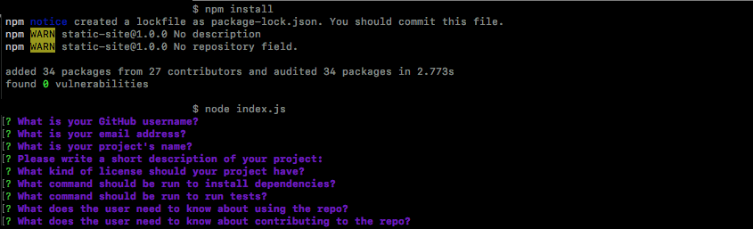

# README Generator

  []

  ## Description

  

  This application automatically generates README files for projects.

  ## Table of Contents

  * [Usage](#usage)

  * [License](#license)

  * [Contributing](#contributing)

  * [Tests](#tests)

  * [Questions](#questions)

  ## Installation

  npm i is used to install dependencies.

  ## Usage

  Nothing.

  ## License

  []
  (https://opensource.org/licenses/MIT)

  ## Contributing

  Stop.

  ## Tests

  npm test is used to run tests.

  ## Questions

  Have a question? Email me directly at chadgtbootcamp@gmail.com.
  Check out my other projects at [chadfromspace](https://github.com/README Generator).